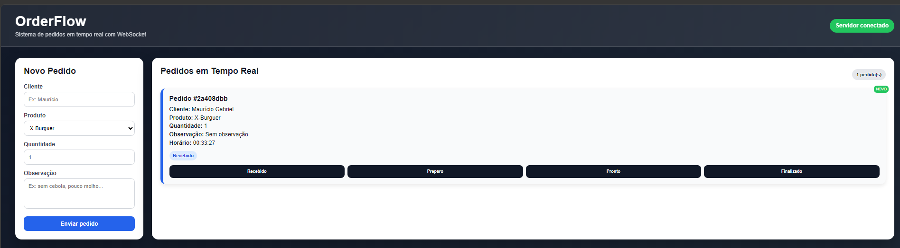

# 🚀 OrderFlow - Sistema de Pedidos em Tempo Real

## 📸 Preview do Sistema



## Disciplina
Computação Distribuída

## Autor
Maurício Gabriel de Oliveira Becker

---

## Sobre o Projeto

Este projeto consiste em um sistema de pedidos em tempo real utilizando WebSocket.

O servidor foi desenvolvido em Python e o cliente em JavaScript, permitindo comunicação instantânea entre múltiplos usuários.

---

## Funcionalidades

- Criar pedidos
- Atualizar status
- Visualização em tempo real
- Múltiplos clientes conectados simultaneamente

---

## Tecnologias

- Python
- WebSocket
- JavaScript
- HTML/CSS

---

## ▶️ Execução

1. Instalar a biblioteca:

```bash
pip install websockets
```

2. Executar o servidor:

```bash
cd servidor
python server.py
```

3. Abrir o sistema:

Abrir o arquivo:

```txt
cliente/index.html
```

4. Testar em tempo real:

Abra o sistema em duas abas do navegador e crie um pedido.  
As atualizações serão refletidas automaticamente entre as abas.

---

## 🎯 Objetivo

Demonstrar o uso de WebSocket em uma aplicação distribuída, evidenciando comunicação bidirecional em tempo real, estado global no servidor e concorrência entre múltiplos clientes.

---

## 📌 Observação

O uso de WebSocket elimina a necessidade de requisições constantes ao servidor, permitindo uma comunicação mais eficiente e em tempo real entre cliente e servidor.
